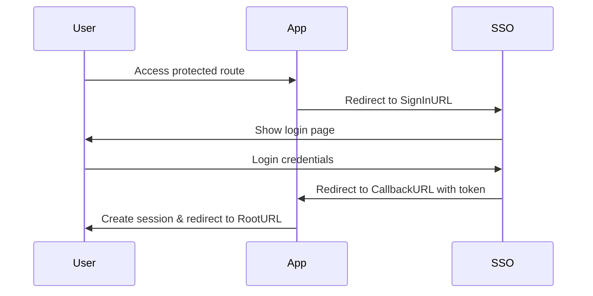

# SSO Client Library Breakdown

## Required Configuration

### Essential Configs
```go
type Config struct {
    // Core SSO URLs (Required)
    CallbackURL string // Where SSO provider redirects after auth
    SignInURL   string // SSO provider's login URL
    RootURL     string // Application's root URL for redirects after auth

    // Session Configuration (Required)
    SessionName   string // Name of the session cookie
    SessionKey    string // Key for encrypting session data
    SessionMaxAge int    // Base session duration in seconds

    // Redis Configuration (Required)
    RedisURI      string // Redis connection string
    IsRedisSecure bool   // Whether to use secure cookies
}
```

### Optional/Removable Configs
1. `SignOutURL` - Not actively used in the codebase, can be removed
2. `SessionExtensionDuration` - Only used if sliding window is enabled
3. `SessionExtensionThreshold` - Only used if sliding window is enabled
4. `EnableSlidingWindow` - Can be removed if sliding window feature is not needed

## Authentication Flow

### 1. Initial Authentication


### 2. Endpoints

#### Public Endpoints
- `GET /auth/signin` - Initiates SSO flow
- `GET /auth/callback` - Handles SSO callback with token
- `POST /auth/signout` - Handles user logout

#### Protected Endpoints
- `GET /api/user` - Get user details (requires auth)
- Any route under `/api/*` - Protected by auth middleware

### 3. Session Management

#### Basic Session
- Sessions stored in Redis
- Default expiry set by `SessionMaxAge`
- Secure cookie settings controlled by `IsRedisSecure`

#### Sliding Window (Optional)
If enabled:
- Extends session by `SessionExtensionDuration`
- When remaining time < `SessionExtensionThreshold`
- Requires `EnableSlidingWindow = true`

## Database Structure

### User Model
```go
type User struct {
    ID        uint
    Email     string
    Name      string
    CreatedAt time.Time
    UpdatedAt time.Time
}
```

### Access Token Model
```go
type UserAccessToken struct {
    ID        uint
    UserID    uint
    JTI       string
    CreatedAt time.Time
    UpdatedAt time.Time
}
```

### SSH Key Model
```go
type SshKey struct {
    ID            uint
    PrivateRsaKey string
    CreatedAt     time.Time
    UpdatedAt     time.Time
}
```

## Integration Steps

1. Initialize Config:
```go
cfg := &config.Config{
    CallbackURL: "http://localhost:3001/auth/callback",
    SignInURL: "https://sso-provider.com/login",
    RootURL: "http://localhost:3001",
    
    SessionName: "app_session",
    SessionKey: "secure-key",
    SessionMaxAge: 3600,
    
    RedisURI: "redis://:password@localhost:6379/0",
    IsRedisSecure: true,
}
```

2. Create Client:
```go
client, err := ssoclient.New(cfg)
if err != nil {
    log.Fatal(err)
}
```

3. Setup Database:
```go
client = client.WithRepository(primaryDB, secondaryDB)
```

4. Configure Routes:
```go
handlers := client.GetHandlers()
middleware := client.GetMiddleware()

// Auth routes
router.GET("/auth/signin", handlers.SignIn)
router.GET("/auth/callback", handlers.Callback)
router.POST("/auth/signout", handlers.SignOut)

// Protected routes
api := router.Group("/api")
api.Use(middleware.RequireAuth)
api.Use(middleware.SetUserID)
```

## Security Considerations

1. Always use HTTPS in production
2. Secure Redis with authentication
3. Use strong session keys
4. Implement rate limiting
5. Monitor for suspicious activities 